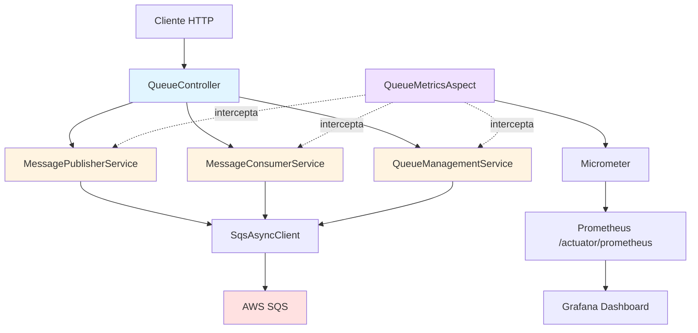

# AWS SQS Project with Observability

Projeto Spring Boot 3+ para gerenciamento de filas AWS SQS com observabilidade completa usando Prometheus e Grafana.Desenvolvimento com mensageria na AWS, criação dinâmica de filas, e monitoramento em tempo real.

## 🎯 Objetivo

- Criação dinâmica de filas AWS SQS via API REST
- Publicação e consumo de mensagens JSON
- Observabilidade completa com métricas avançadas
- Arquitetura escalável seguindo Clean Code e SOLID principles
- Virtual Threads para operações I/O-bound

## 🏗️ Arquitetura

Projeto estruturado seguindo **Clean Code e SOLID principles**, com separação clara de responsabilidades:

```
controller/      # REST Controllers (API Layer)
service/         # Services com lógica de negócio (Single Responsibility)
model/           # Records/DTOs
config/          # Configurações (AWS, Actuator, Virtual Threads)
metrics/         # Métricas customizadas e Aspects (cross-cutting)
aws/             # Cliente AWS SQS
```

### Diagrama de Arquitetura



## 🛠️ Stack Tecnológica

### Core
- **Java 21** - Records, Pattern Matching, Virtual Threads
- **Spring Boot 3.3+** - Framework principal
- **Maven** - Gerenciamento de dependências

### AWS Integration
- **AWS SDK v2** - `software.amazon.awssdk:sqs` (SqsAsyncClient)
- **Spring Cloud AWS Messaging** - Integração com AWS SQS

### Observabilidade
- **Micrometer** - Métricas de aplicação
- **Prometheus** - Coleta e armazenamento de métricas
- **Grafana** - Visualização e dashboards

### Concorrência
- **Virtual Threads** - Para operações I/O-bound (AWS SDK)

### Cross-Cutting Concerns
- **AspectJ** - AOP para métricas e cross-cutting concerns

### Testes
- **JUnit 5** - Framework de testes
- **Mockito** - Mocking framework
- **Testcontainers** - Testes de integração com LocalStack

## 📦 Estrutura do Projeto

```
src/
├── main/
│   ├── java/
│   │   └── com/
│   │       └── aws/
│   │           └── sqs/
│   │               ├── controller/
│   │               │   └── QueueController.java
│   │               ├── service/
│   │               │   ├── QueueManagementService.java
│   │               │   ├── MessagePublisherService.java
│   │               │   └── MessageConsumerService.java
│   │               ├── model/
│   │               │   └── dto/
│   │               │       ├── MessageRequest.java
│   │               │       ├── MessageResponse.java
│   │               │       ├── QueueCreateRequest.java
│   │               │       └── QueueResponse.java
│   │               ├── config/
│   │               │   ├── ObservabilityConfig.java
│   │               │   └── VirtualThreadConfig.java
│   │               ├── metrics/
│   │               │   ├── QueueMetrics.java
│   │               │   └── QueueMetricsAspect.java
│   │               └── aws/
│   │                   ├── SqsClientConfiguration.java
│   │                   └── AwsProperties.java
│   └── resources/
│       ├── application.yml
│       └── application-dev.yml
├── test/
│   └── java/
│       └── com/
│           └── aws/
│               └── sqs/
│                   ├── service/
│                   ├── controller/
│                   └── aws/
docker/
├── docker-compose.yml
├── prometheus/
│   └── prometheus.yml
└── grafana/
    ├── dashboards/
    └── provisioning/
```

## 🚀 Como Executar

### Pré-requisitos

- Java 21+
- Maven 3.8+
- Docker e Docker Compose
- Credenciais AWS configuradas (ou LocalStack para desenvolvimento)

### Configuração AWS

Configure as credenciais AWS via variáveis de ambiente:

```bash
export AWS_ACCESS_KEY_ID=your-access-key
export AWS_SECRET_ACCESS_KEY=your-secret-key
export AWS_REGION=us-east-1
```

Para desenvolvimento local com LocalStack:

```bash
export AWS_ENDPOINT_URL=http://localhost:4566
export AWS_REGION=us-east-1
```

### Executar a Aplicação

1. Clone o repositório:
```bash
git clone <repository-url>
cd aws-sqs-sns-project-observability
```

2. Compile o projeto:
```bash
mvn clean install
```

3. Execute a aplicação:
```bash
mvn spring-boot:run
```

A aplicação estará disponível em: `http://localhost:8080`

### Executar Observabilidade (Docker)

1. Inicie os serviços de observabilidade:
```bash
docker-compose up -d
```

2. Acesse os dashboards:
   - **Grafana**: http://localhost:3000 (admin/admin)
   - **Prometheus**: http://localhost:9090
   - **Spring Actuator**: http://localhost:8080/actuator/prometheus

## 📡 Endpoints REST

### Gerenciamento de Filas

| Método | Endpoint | Descrição |
|--------|----------|-----------|
| `POST` | `/api/queues` | Criar fila dinamicamente |
| `GET` | `/api/queues` | Listar todas as filas |
| `GET` | `/api/queues/{queueName}/attributes` | Obter atributos da fila |
| `DELETE` | `/api/queues/{queueName}` | Remover fila |

### Mensagens

| Método | Endpoint | Descrição |
|--------|----------|-----------|
| `POST` | `/api/queues/{queueName}/messages` | Publicar mensagem na fila |
| `POST` | `/api/queues/{queueName}/consume` | Consumir mensagens da fila (polling manual) |

### Health & Metrics

| Método | Endpoint | Descrição |
|--------|----------|-----------|
| `GET` | `/actuator/health` | Health check da aplicação |
| `GET` | `/actuator/prometheus` | Métricas no formato Prometheus |

## 📊 Métricas de Observabilidade

O projeto expõe métricas customizadas via Micrometer:

### Métricas Principais

1. **sqs.messages.sent.total** - Contador de mensagens enviadas
   - Labels: `queue_name`, `status` (success/error)

2. **sqs.messages.received.total** - Contador de mensagens consumidas
   - Labels: `queue_name`, `status` (success/error)

3. **sqs.message.processing.duration** - Timer de latência de processamento
   - Labels: `queue_name`, `operation` (publish/consume)

4. **sqs.queue.size** - Gauge do tamanho da fila
   - Labels: `queue_name`

5. **sqs.queue.created.total** - Contador de filas criadas

### Dashboard Grafana

O dashboard pré-configurado inclui:
- **Painel 1**: Mensagens enviadas/consumidas (time series)
- **Painel 2**: Latência de processamento (histogram)
- **Painel 3**: Tamanho das filas (gauge)
- **Painel 4**: Taxa de erros (rate)
- **Painel 5**: Throughput (mensagens/segundo)

## 🔧 Configuração

### application.yml

```yaml
spring:
  application:
    name: aws-sqs-observability

server:
  port: 8080

aws:
  region: ${AWS_REGION:us-east-1}
  endpoint-url: ${AWS_ENDPOINT_URL:}
  
management:
  endpoints:
    web:
      exposure:
        include: health,info,prometheus
  metrics:
    export:
      prometheus:
        enabled: true
```

## 📝 Exemplos de Uso

### Criar Fila

```bash
curl -X POST http://localhost:8080/api/queues \
  -H "Content-Type: application/json" \
  -d '{
    "queueName": "my-queue",
    "enableDlq": true,
    "maxReceiveCount": 3
  }'
```

### Publicar Mensagem

```bash
curl -X POST http://localhost:8080/api/queues/my-queue/messages \
  -H "Content-Type: application/json" \
  -d '{
    "body": {
      "id": "123",
      "message": "Hello SQS",
      "timestamp": "2024-01-01T10:00:00Z"
    }
  }'
```

### Consumir Mensagens

```bash
curl -X POST http://localhost:8080/api/queues/my-queue/consume \
  -H "Content-Type: application/json" \
  -d '{
    "maxMessages": 10,
    "waitTimeSeconds": 5
  }'
```

## 🧪 Testes

Execute os testes:

```bash
mvn test
```

### Cobertura de Testes

- Testes unitários para Services
- Testes de integração para Controller (MockMvc)
- Testes de integração com AWS SQS (Testcontainers LocalStack)

## 🏛️ Princípios Aplicados

### SOLID

- **Single Responsibility**: Cada service tem uma única responsabilidade
- **Open/Closed**: Extensível via interfaces, fechado para modificação
- **Dependency Inversion**: Dependência de abstrações (SqsAsyncClient injetado)

### Clean Code

- Código legível e auto-documentado
- DTOs como Records (imutáveis)
- Validação fail-fast
- Separação de concerns via AspectJ

### Concorrência

- Virtual Threads para operações I/O-bound
- SqsAsyncClient para operações assíncronas

## 🔐 Segurança

- Validação de entrada com Bean Validation
- Tratamento de erros customizado
- Health checks para monitoramento

## 📚 Dependências Principais

```xml
<dependencies>
    <dependency>
        <groupId>org.springframework.boot</groupId>
        <artifactId>spring-boot-starter-web</artifactId>
    </dependency>
    <dependency>
        <groupId>software.amazon.awssdk</groupId>
        <artifactId>sqs</artifactId>
    </dependency>
    <dependency>
        <groupId>io.micrometer</groupId>
        <artifactId>micrometer-registry-prometheus</artifactId>
    </dependency>
    <dependency>
        <groupId>org.springframework.boot</groupId>
        <artifactId>spring-boot-starter-actuator</artifactId>
    </dependency>
    <dependency>
        <groupId>org.springframework.boot</groupId>
        <artifactId>spring-boot-starter-aop</artifactId>
    </dependency>
</dependencies>
```

## 🐳 Docker Compose

O `docker-compose.yml` inclui:
- **Prometheus** - Coleta de métricas
- **Grafana** - Visualização de dashboards
- Auto-provisioning de dashboards

## 🤝 Contribuindo

Este é um projeto de demonstração de capacidades técnicas.

## 📄 Licença

Este projeto é para fins de demonstração e portfólio.

---

**Desenvolvido seguindo Clean Code e SOLID principles**
